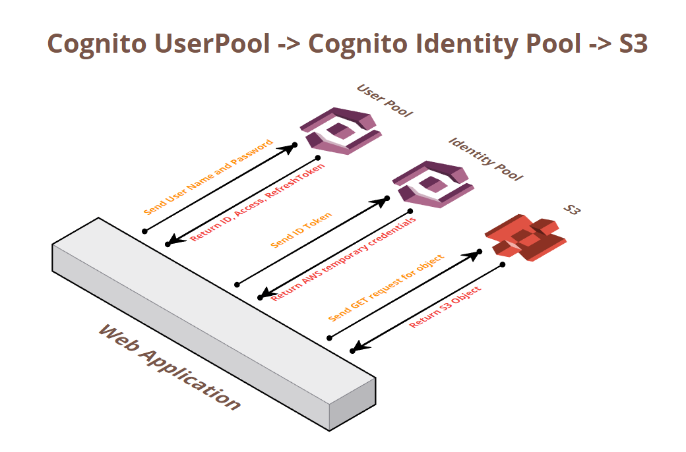
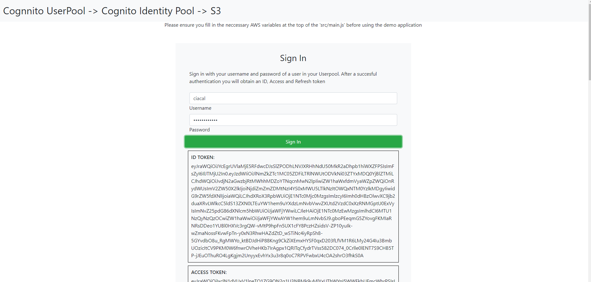
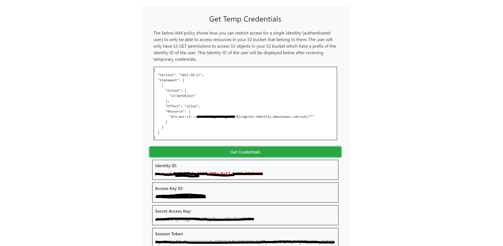
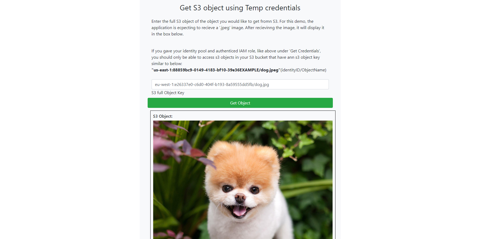

# Cognito-S3-App-Demo

This is a sample application that I have created which is intended to help better explain how you can integrate Cognito User Pools, Cognito Identity Pools and S3 to your mobile or web application.

Services:
  
  - Cognito UserPool:
  A user pool is a user directory in Amazon Cognito. With a user pool, your users can sign in to your web or mobile app through Amazon Cognito.

  - Cognito Identity Pool:
  Amazon Cognito identity pools provide temporary AWS credentials for users who are guests (unauthenticated) and for users who have been authenticated and received a token. An identity pool is a store of user identity data specific to your account.
  
  - S3:
  Amazon Simple Storage Service (Amazon S3) is an object storage service that offers industry-leading scalability, data availability, security, and performance.
  
Application Flow:
  
  - Sign into your User Pool with a users username and password. After a succesfull authentication, you will recive and ID, Access and Refresh token.
  
  
  
  - Exchange the ID token recieved from the userpool to obtain authenticated user temporary AWS credentials from the Identity Pool.
  
  
   
   
  - SDK will assume the credentials and you will be able to make requests to AWS S3.
  
  
   
   
Reach out to me here if you have any questions:
https://www.linkedin.com/in/ciaran-callaghan/
